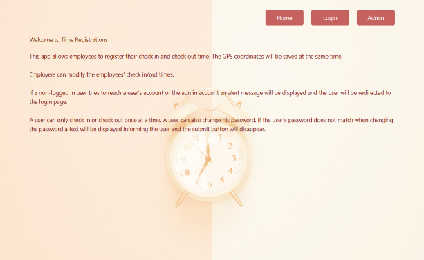
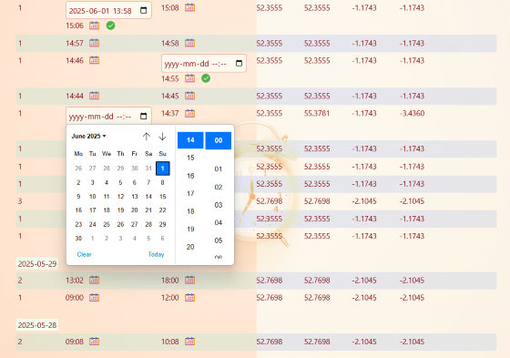

# Introduction

Time Registrations is a web application allowing employees to register their check in and check out time. The GPS coordinates will be saved at the same time.

Employers can modify the employees' check in/out times. The check in/out times cannot be modified if they overlap.

If a non-logged in user tries to reach a user's account or the admin account an alert message will be displayed and the user will be redirected to the login page.

A user can only check in or check out once at a time. A user can also change his password. If the user's password does not match before trying to change the password a text will be displayed informing the user and the submit button will disappear.

The website is responsive and is using the CSS Grid Layout Module.

# Technologies

Backend: PHP 8.3 / Laravel 11 / REST APIs / MariaDB / Eloquent (ORM)

Frontend: Vue 3 / Vite / HTML / CSS / CSS Grid Layout Module / Tailwind CSS / JavaScript / TypeScript / RWD

# Setup

### Backend

In *database/sql* there are different DDL/DML files to be used with the database.
Since the migrations already exists, each of the files in the said folder can be used directly with MariaDB, except the creation of the database itself.
First, either change the database/username/password to be used with your MariaDB instance, or use those preconfigured with the application's *.env* file. (You need to create a user and grant necessary privileges on your MariaDB server.)
Second, create the database and execute the sql files in correct order, e.g. `mariadb -u time_reg -ptime_registrations -D time_registrations < database/sql/some_file`. The order should be first the users and after that the timestamps table, and there is also test data to be tried on, insert users and timestamps, respectively.

In the root of the repo run `composer install` and `composer run dev`. This will install the project's dependencies and start the backend application.

### Frontend

Go to the *frontend* folder and run `npm install` and `npm run dev` to start the website.
